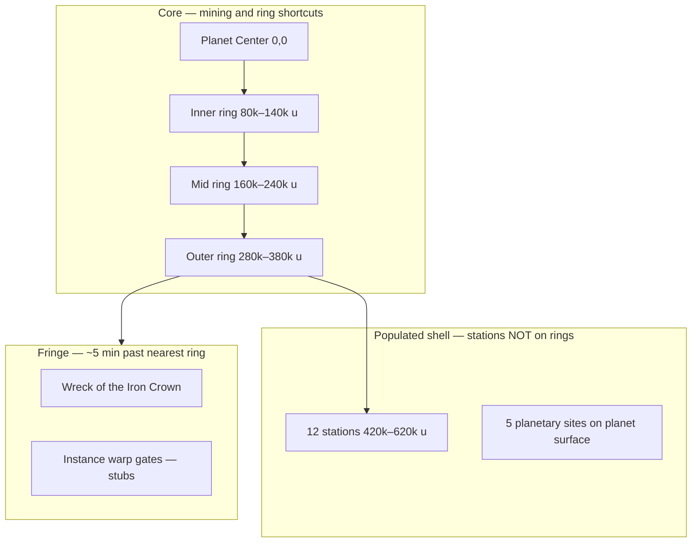
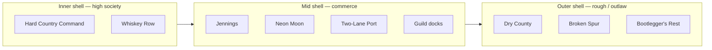
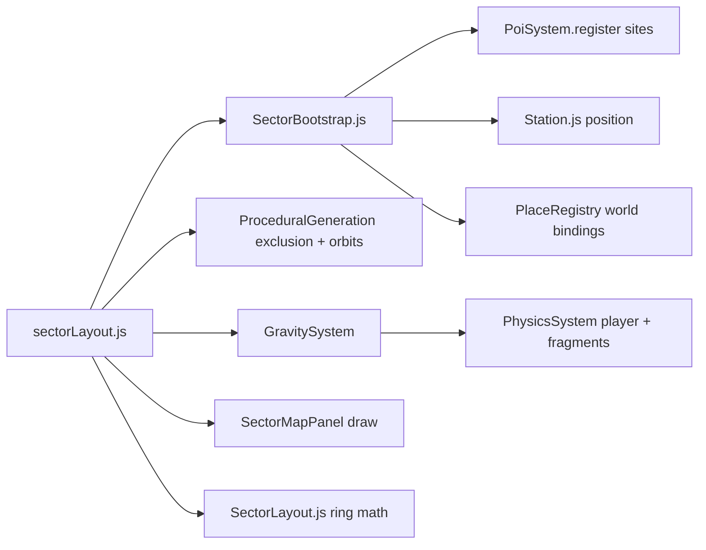
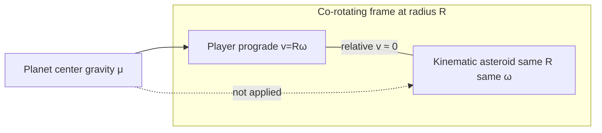
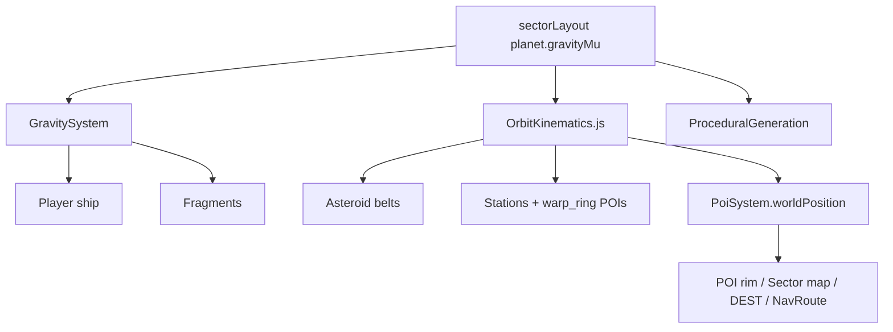
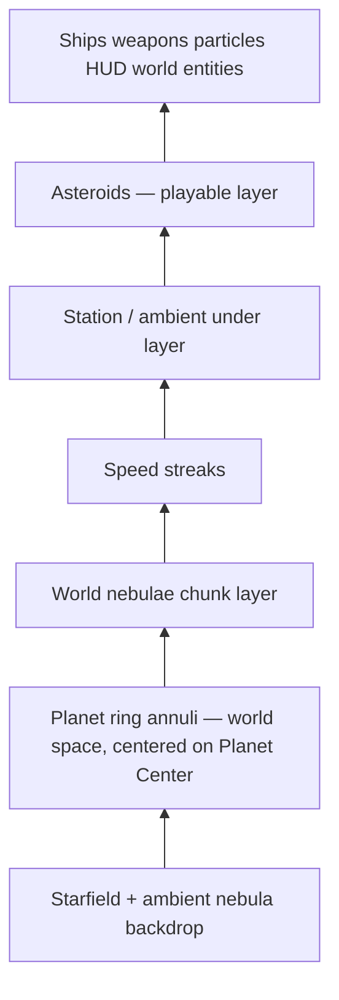
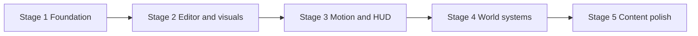

# World Geography Plan

> **Implementation status:** **RESTORED** (2026-07-24). Rebuilt from agent transcript after v0.1.286 revert. Edge benchmarks ~75 FPS at full zoom-out on reverted build — geography + perf work re-applied; validate in standalone browser (not Cursor embedded browser).

> **Build policy:** **Stage 1 only** per session unless the user explicitly approves the next stage. Full Stages 1–5 were restored in one pass per user request.

## Post-plan decisions (locked after plan freeze)

These were agreed in discussion **after** the initial plan draft and must stay in any implementation:

| Topic | Decision |
|-------|----------|
| **System name** | **Thera system** — retire **Kesta System** everywhere (`meta.name`, labels, docs). |
| **Planet names** | **Therissa Prime** (official) · **Thera** (short HUD/chart copy). |
| **Origin** | Planet Center `(0,0)` on Thera — **not** Jennings. Jennings moves to authored orbital slot. |
| **Fringe distance** | Unique POIs ~**5 min past nearest ring** (~270k u), not 10 min from center. |
| **Kinematic POIs** | Belts, **all 12 stations**, `warp_ring` gates orbit; **deep fringe** (`landmark`, `warp_instance`) static. |
| **HUD positions** | Orbiting POIs use **`worldPosition(poi, gameTime)`** — never stale bootstrap `x/y`. |
| **Co-orbit assist** | TELEMETRY **prograde speed** hint; **SYNC hold** (not one-shot toggle) at **≥95%** manual match — while held, Precision-authority thrusters track contact **live** velocity/heading. |
| **Regulatory speed** | Posted **LIM** zones + fines when witnessed — **not** a physics speed clamp (`USE_MAX_SPEED_CAP: false`). |
| **Hangar vs moving station** | Interior/hangar is **local sim**; overworld station anchor follows orbit **only outside** the interior (see Deferred below). |

## Design intent (locked from discussion)

- **Planet:** **Therissa Prime** (official) · **Thera** (short). World `(0, 0)` = **Planet Center** on Thera (2D top-down map origin + gravity anchor), not Jennings.
- **Planet spin:** The planet body rotates **once every 30 game-hours** (`108,000` s at 1× `gameTime`). Rings, belts, and orbital mechanics stay in the **inertial** frame around Planet Center; only the disc + **surface-fixed** sites co-rotate.
- **One bounded system — the Thera system** — Therissa Prime + asteroid rings + populated orbital shell + deep-space fringe (not infinite void).
- **17 major sites:**
  - **5 planetary landing spots** (surface/outpost — future on-foot or landing sequences): farm, industrial, cosmetics city, rebuild farm, trading port — themed names in roster below.
  - **12 orbital stations** (open space, **not on ring bands**): **Jennings + 11 Jennings-clone ports** with **Outlaw Country 80s–90s** names (structural clones; balance/traffic fine-tuned later).
- **Ring warp gates:** **3 pairs / 6 gates** total (one pair per ring band — inner, mid, outer); short-hop through planet center.
- **Fringe landmarks:** **One** static battle-lost capital-ship wreck for now. Additional deep POIs **generated from mission-board jobs later** (not hand-authored in v1).
- **Map edge:** **Soft empty fringe** at ~750k u — sparse void, no hard invisible wall.
- **Traffic fines:** **Per issuing station** (not faction-wide). **Pirate:** no traffic rules. **Military:** strictest limits + heaviest patrols. **Higher social tier** → more patrols (poor → elite). See [Regulatory speed limits](#regulatory-speed-limits-traffic-law).
- **First-pass layout:** Ship a **best-effort authored bootstrap** in `sectorLayout.js` v2 **and** a **polished dev Sector Map editor** as the primary tuning tool (not JSON-only).
- **Transit corridors:** Shortest-path **lanes between stations** (chord when clear of the planet, else curved tangent route around the disc) are **natural high-traffic zones** — ambient NPC spawn density scales up inside corridor bands (see [Proc gen and traffic adjustments](#proc-gen-and-traffic-adjustments)).
- **Social orbit ladder:** **Elite + military** sit **closest** to the planet in the station shell; each step **outward** drops social tier until **pirate (outlaw)** at the **outer edge**. Stations are **spread around the full 360°** (existing spacing rules); **multiple ports may share the same `orbitR`** (same “ring” distance) if angular separation keeps ≥5 min chord clearance.
- **Spacing:** Closest pair among orbital/space POIs ≥ **5 min at reference transit speed** (~900 u/s baseline for map authoring — not a hard in-flight cap; see [Physics speed limits](#physics-speed-limits-open-space-flight)).
- **Instance warp gates** (`warp_instance`): fringe stubs only in v1; destination content later.
- **Belt motion:** Ring asteroids, **all 12 stations**, **`warp_ring` gates**, use **kinematic orbits** around **Planet Center**. **Deep fringe** (`landmark`, `warp_instance`) stay **static**. Player + fragments use **gravity**. HUD always **calculates** live world position for orbiting POIs (see [Planetary gravity + kinematic belt orbits](#planetary-gravity--kinematic-belt-orbits)).
- **Co-orbit assist:** TELEMETRY **prograde speed** hint; **SYNC** hold button (like space brakes) — enabled at **≥95%** manual match; while held, auto-thrusters at **Precision authority** track the contact's **live** speed/heading each frame (not a toggle; no deselect required).
- **Visual read:** Viewport — ring annuli above starfield, below asteroids/ships; Sector map — planet/rings brightness follows fog (unseen dark → stale dim → active full). See [Visual layers](#visual-layers-viewport--sector-map).
- **Traffic law (regulatory speed):** Posted **speed limits** by zone (planet ring bands + per-station distance shells) — **not** a physics clamp (auto-throttle may come later). Exceeding the posted limit triggers **automatic fines** when **witnessed** (inner ring: station **sensors**; elsewhere: **patrol** line-of-sight). Unpaid debt blocks **trade** past a threshold; higher debt → **outlaw** (station attacks). Pay off at a **broker** at any station. See [Regulatory speed limits (traffic law)](#regulatory-speed-limits-traffic-law).

---

## Scale math (drives all radii)

Using existing [`KM_SCALE: 100`](src/core/Constants.js) (100 world units = 1 km):

| Duration @ reference transit (~900 u/s) | Distance (world units) | Distance (km) |
|----------|------------------------|---------------|
| 5 min | **270,000** | 2,700 km |

Two distinct uses of that distance:

1. **Orbital spacing** — closest pair among stations / major orbital POIs ≥ 270,000 u apart.
2. **Fringe placement** — unique POIs (capitals, instance gates) ≥ 270,000 u from the **nearest ring band** (measured to the closest point on that ring's inner or outer edge).

Current [`sectorLayout.js`](src/world/data/sectorLayout.js) outer ring is **58,000 u (~580 km)** — the whole map today is crossable in ~1 minute. The new geography requires roughly **10×** radial expansion (smaller than the prior 10-min-deep-fringe estimate).

**Minimum station ring radius** (12 stations evenly on a circle, chord ≥ 270,000 u):

`R ≥ 270,000 / (2 × sin(π/12)) ≈ 521,000 u (~5,210 km)`

Recommended **target radii** (round numbers, tunable in dev editor):



| Zone | Radius from planet center (world u) | km | Notes |
|------|-------------------------------------|-----|-------|
| Planet body (**Thera**) | **35,000** | 350 | Disc centered at Planet Center; 5 surface sites by angle on the rim |
| Inner ring | 80,000 – 140,000 | 800–1,400 | Iron-heavy; ring shortcut gates here |
| Mid ring | 160,000 – 240,000 | 1,600–2,400 | Mixed composition |
| Outer ring | 280,000 – 380,000 | 2,800–3,800 | Ice-rich; more shortcut gates |
| Station field | 420,000 – 620,000 | 4,200–6,200 | 12 stations in **gaps** between ring bands — **social tier ↓ as `orbitR` ↑** (elite/military inner → pirate outlaw outer); spread around 360°; **same `orbitR` allowed** for co-tier peers |
| Unique fringe | **~650,000** from center | ~6,500 | Outer ring edge (380k) + **270k** (~5 min) clearance |
| Map soft edge | ~750,000 | 7,500 | **Soft empty fringe** — sparse void, no hard wall; no new authored content beyond ~750k |

**Fringe distance helper:** For a POI at `(x,y)`, compute distance to the nearest ring annulus (planet-center radii). Require `distToNearestRing ≥ 270,000`. POIs outside the outer ring typically land at `outerR + 270,000 ± margin`.

**Planetary vs orbital spacing:** The 5 min rule applies to **orbital/space POIs** (stations, deep sites, gates). The five planetary sites live on the planet surface (distinct lat/lon on the big disc); inter-site travel there is a separate future mode (surface/walker/fast-travel), not max-speed Newtonian flight.

---

## Coordinate model

**Planet Center at origin** (2D top-down; flight north = −Y per [`SHIP.SPAWN_ANGLE`](src/core/Constants.js)):

- **`planet.center = { x: 0, y: 0 }`** — world origin, sector-map origin, gravity source, ring hub
- **All radii** (`innerR`, `outerR`, orbit `R`, fringe distance) measured from **Planet Center**
- **Planet disc** — radius `planet.radius`, drawn centered at `(0, 0)`; **spins** at `ω_planet = 2π / rotationPeriod` (30 h default)
- **Planetary surface sites** — authored as **`surfaceAngle`** on the disc (fixed to the rotating surface). World position each frame: `(cos(θ_s + ω_planet × gameTime), sin(θ_s + ω_planet × gameTime)) × planet.radius` from Planet Center. Sector map / POI rim / nav bearing must use **`worldPosition(poi, gameTime)`** for planetary sites (same rule as orbiting POIs)
- `SectorMapPanel` / `SectorLayout.radiusAt(x, y)` use `hypot(x, y)` from Planet Center
- **Jennings** moves to an authored orbital slot in the station field — no longer `(0,0)`

Migration note: saved POI coords in `localStorage` (`NavPersistence`) will invalidate; bump persistence version and reset or remap on load.

**Naming (player-facing vs code):**

| Context | Use |
|---------|-----|
| **Star system** (bounded play area) | **Thera system** — layout `meta.name: 'Thera System'` |
| **Planet** (world at origin) | **Therissa Prime** (official) · **Thera** (short — disambiguate from system in copy when both appear) |
| Code / coords / gravity anchor | **Planet Center** `(0,0)` — geometry term in modules |

---

## Authoritative data: `sectorLayout.js` v2

Extend [`src/world/data/sectorLayout.js`](src/world/data/sectorLayout.js) to be the **single source of truth** for geography (replacing duplicated hardcodes in [`PoiSystem._seed()`](src/world/PoiSystem.js) and [`STATION.WORLD_X/Y`](src/core/Constants.js)).

Proposed schema additions:

```js
export const SECTOR_LAYOUT = {
  meta: { name: 'Thera System', version: 2 },
  planet: {
    nameOfficial: 'Therissa Prime',
    nameShort: 'Thera',
    radius, center: { x: 0, y: 0 }, visualSeed, palette,
    gravityMu, influenceRadius,
    rotationPeriodHours: 30,   // 108_000 s @ 1× gameTime; ω = 2π / period
    rotationAngle0: 0,         // optional bootstrap phase (rad)
  },
  rings: [ /* id, innerR, outerR, density, composition — ω derived from μ at spawn R */ ],
  sites: [
    // kind: 'station' | 'planetary' | 'warp_ring' | 'warp_instance' | 'landmark'
    // motion: 'orbit' | 'surface' | 'static'  (default by kind)
    // orbit: { orbitR, orbitAngle0, orbitOmega }  — authored at bootstrap; x,y are bootstrap snapshot only
    { id, kind, motion?, orbit?, surfaceAngle?, placeId?, name, iff,
      socialTier?, trafficPolicy?, patrolDensity?, ... },
  ],
  spacing: { minOrbitalSep: 270000, minFringeFromRing: 270000, referenceTransitSpeed: 900 },
  trafficCorridors: {
    halfWidth: 30000,           // world u — band around shortest path
    spawnMultiplier: 2.5,       // ambient traffic weight inside band
    clearMargin: 8000,          // extra clearance beyond planet.radius for chord test
    recomputePeriodSec: 3600,   // optional: refresh lane geometry as stations orbit (0 = fixed at bootstrap)
  },
};
```

**Site roster (v1 names — outlaw-country 80s–90s theme; `orbitR` bands are bootstrap targets, editable in editor):**

| ID | Display name | `socialTier` | Target `orbitR` (u) | Notes |
|----|--------------|--------------|---------------------|-------|
| `site.station.military` | **Hard Country Command** | military | **~430–450k** (inner) | Strictest traffic; may **share R** with elite |
| `site.station.elite` | **Whiskey Row Station** | elite | **~430–450k** (inner) | Heavy patrols; may **share R** with military |
| `site.jennings` | **Jennings Station** | home | **~470–490k** | Mid commercial hub; full hangar Place |
| `site.station.upper` | **Neon Moon Berth** | upper | **~500–520k** | |
| `site.station.mid` | **Two-Lane Port** | mid | **~530–550k** | |
| `site.station.guild.a` | **Red Dirt Collective** | guild | **~520–560k** | Spread around shell; may share R with mid/upper peers |
| `site.station.guild.b` | **Lonesome Star Dock** | guild | **~520–560k** | |
| `site.station.guild.c` | **Honky Tonk Berth** | guild | **~520–560k** | |
| `site.station.guild.d` | **Outlaw Junction** | guild | **~560–580k** | Slightly outer guild — name fits fringe tone |
| `site.station.poor` | **Dry County Terminal** | poor | **~570–590k** | |
| `site.station.derelict` | **Broken Spur Yard** | derelict | **~580–600k** | Player rebuild; outer shell |
| `site.station.pirate` | **Bootlegger's Rest** | pirate | **~600–620k** (outer) | **Outlaw** — outermost station shell; no traffic rules |

**Non-station sites** (unchanged by social ladder):

| ID | Kind | Display name | Placement |
|----|------|--------------|-----------|
| `site.planet.*` (×5) | planetary | Back Forty, Copperhead Works, … | `surfaceAngle` on planet disc |
| `site.warp.ring.*` (×6) | warp_ring | Inner / mid / outer gate pairs | Inside ring annuli |
| `site.landmark.capital.wreck` | landmark | **Wreck of the Iron Crown** | Static fringe (~650k+) |
| `site.warp.instance.*` | warp_instance | *(stub)* | Static fringe |

### Social orbit ladder (authoring rule)



- **Radial rule:** lower `socialTier` rank → **smaller** `orbitR` (closer to Planet Center). Validator **warns** if a higher-tier site is placed outside a lower-tier one (elite inside pirate, etc.).
- **Angular rule:** distribute `orbitAngle0` around **360°** so no two neighbors violate **≥270k** closest approach (same as today). At shared `orbitR`, minimum angular gap: `Δθ ≥ 2 × arcsin(minOrbitalSep / (2 × orbitR))`.
- **Co-located peers:** two (or more) stations at the **same `orbitR`** is **explicitly allowed** — e.g. military + elite on the inner “ring”; guild trio sharing ~540k with different angles. Closest-approach check still applies (different angles on same circle, or different R with offset angles).
- **Jennings** is the **commercial hub** — mid-inner, not the innermost (that honor goes to power: military/elite).

Fine-tune exact radii, patrol counts, and limit numbers in the **Sector Map editor** after bootstrap ships.

**Motion defaults by kind:**

| Kind | Motion | Position source |
|------|--------|-----------------|
| `station`, `warp_ring` | `orbit` | `OrbitKinematics.positionAt(simTime)` |
| `planetary` | `surface` | **`surfaceAngle` + planet spin** → `worldPosition(poi, gameTime)` on disc rim |
| `landmark`, `warp_instance` | `static` | Authored `x, y` (deep fringe only) |
| Manual player pins | `static` | Dropped world coords (unchanged) |

**Placement rules (enforced in dev tooling):**
- Orbiting sites: **not** inside any ring annulus (`ringAt` at `t=0` snapshot); pairwise **closest-approach** separation ≥ `minOrbitalSep` (270k) — validates across full orbit or at `t=0` with offset `orbitR` / `orbitAngle0`
- **Social ladder:** `orbitR` should increase as tier decreases (military/elite inner → pirate outer); editor **warns** on inversion
- **Shared radius OK:** multiple stations may use the **same `orbitR`** (co-tier or paired inner ports) — separate by **`orbitAngle0`** with sufficient chord gap
- Unique fringe sites (`kind ∈ {landmark, warp_instance}`): **static** coords; **not** inside any ring; `distToNearestRing ≥ minFringeFromRing` (~5 min)
- Ring warp gates: **inside** a ring volume on **kinematic orbit**; **exactly 3 pairs (6 gates)** — inner / mid / outer band, each pair on **opposite sides** of the planet (teleport reflects through Planet Center)

---

## System wiring (eliminate duplication)

Today three sources disagree:

| Source | Problem |
|--------|---------|
| [`sectorLayout.fixedPois`](src/world/data/sectorLayout.js) | Never loaded into gameplay |
| [`PoiSystem._seed()`](src/world/PoiSystem.js) | Hardcoded coords × `STATION.SCALE` |
| [`STATION.WORLD_X/Y = 0`](src/core/Constants.js) | Jennings at origin, overlaps planet |

**Target flow:**



New module: [`src/world/SectorBootstrap.js`](src/world/SectorBootstrap.js)
- `bootstrapSector(engine)` called from [`GameEngine`](src/core/GameEngine.js) init
- Registers all `sites` into `PoiSystem` with **motion + orbit params** (not static xy for orbiting sites)
- Binds `placeId` → orbital params for Place graph (stations)
- Builds **exclusion discs** around each site's **current** position (updated each tick or conservative max radius)

[`Station.js`](src/world/Station.js): world position from `OrbitKinematics` each frame (Jennings overworld exterior moves on its orbit).

[`PoiSystem`](src/world/PoiSystem.js): **`worldPosition(poi, t)`** is the single resolver — bearing, range, discovery, rim dots, sector map, and nav route **must call this**, never read `poi.x` / `poi.y` directly for **orbiting or planetary** entries. **`t`** = shared world clock ([`GameEngine.gameTime`](src/core/GameEngine.js), seconds); plan text uses `simTime` / `gameTime` interchangeably for this clock.

[`PoiSystem._seed()`](src/world/PoiSystem.js): remove hardcoded scaffold POIs; only bootstrap from layout.

[`NavRoute.js`](src/world/NavRoute.js): POI-ref stops call `worldPosition` each frame when drawing chevrons / arrival checks / sector-map legs.

**Persistence** ([`NavPersistence.js`](src/world/NavPersistence.js)): save **orbit params** for authored sites; manual pins keep static `x,y`; bump version.

---

## Proc gen and traffic adjustments

**Asteroids** ([`ProceduralGeneration.js`](src/systems/ProceduralGeneration.js)):
- Keep ring-weighted composition via [`SectorLayout.js`](src/world/SectorLayout.js)
- Add site **exclusion zones** (no asteroids within N units of stations/gates)
- `isInsidePlayableSector()` expands to ~750k u radius; outside = empty chunks (soft edge)
- **Stage 3:** spawn **orbital params** from seed; position derived from `simTime` + **Planet Center** (see below)

**Ambient traffic** ([`AmbientTrafficSystem.js`](src/world/AmbientTrafficSystem.js)):
- Retarget density rings from `STATION.SCALE`-relative to **layout-relative** (near each station's **live** orbit position, not world origin)
- Police orbit follows each station's **calculated** position each frame
- **Transit corridors (shipping lanes):** Precompute (and optionally refresh) **shortest clear paths** between station pairs — elevated ambient spawn weight inside corridor bands
- **Stage 4:** patrol ships become **traffic witnesses** — can cite speed violations in their station's jurisdiction when player exceeds posted limit and patrol has LOS/range (see [Regulatory speed limits](#regulatory-speed-limits-traffic-law))

### Transit corridors (inter-station traffic lanes)

**Intent:** Routes people actually fly between ports should feel **busier** — freighters, shuttles, flybys cluster along **shortest paths**, not uniformly in open shell.

**Geometry** ([`TransitCorridor.js`](src/world/TransitCorridor.js) — new helper, built at bootstrap from layout):

For each station pair `(A, B)` (all 12×11/2 pairs, or **k-nearest** by orbit if too many overlaps — start with **all pairs**, cull duplicates in editor):

1. Resolve endpoints: `worldPosition(A, t)` and `worldPosition(B, t)` (use `t = 0` for stable authored lanes, or **recompute periodically** so lanes follow slow orbital drift)
2. **Shortest clear path** (2D, Planet Center at origin):
   - If the straight **chord** from A→B stays outside `planet.radius + corridorClearMargin` → corridor = **line segment** with half-width `corridorHalfWidth`
   - Else → **curved route:** two **tangent arcs** around the planet disc (short way around the obstacle — pick the shorter circumferential side). Sample as a polyline band
3. Optional: slight **bulge weight** at corridor midpoint (more spawns mid-lane) vs near stations (station bubbles already handle dock traffic)

**Spawn weighting** ([`AmbientTrafficSystem.js`](src/world/AmbientTrafficSystem.js)):

```js
// At spawn / interest-bubble seed position P:
corridorFactor = max over lanes of falloff(distance(P, lanePolyline), corridorHalfWidth)
spawnWeight *= lerp(1.0, corridorTrafficMult, corridorFactor)  // e.g. corridorTrafficMult = 2.5
```

- **`corridorHalfWidth`** — default ~30,000 u (~300 km), tunable in layout / editor
- **`corridorTrafficMult`** — default ~2.0–3.0× ambient spawn rate inside band
- **Does not** increase police patrol count by default (patrols stay station-tiered); optional later tie for military corridors
- **Asteroids unchanged** — corridors affect **NPC traffic spawn only**, not belt density (keeps mining rings readable)

**Sector map / editor:** Draw semi-transparent **lane overlays** on system zoom (dashed chords / curved tangents); slider for half-width and spawn multiplier; validator warns if a lane clips the planet no-fly disc.

**Ring warp gates** (new stub system):
- **3 pairs / 6 gates** — `pairId: inner | mid | outer`, `pairSide: a | b`; one gate per side of the planet per band
- `WarpGateSystem.js`: proximity trigger → teleport ship to paired gate (reflect through planet center)
- Authored in `sites`; visual stub on sector map + world marker
- Instance gates (`warp_instance`): register POI + interaction stub only; no instance load yet

---

## Planetary gravity + kinematic belt orbits

**Goal:** Ring belts **visibly curve** around the planet; the **player ship curves when coasting** (or at an angle to the pull) near the planet — without full N-body sim on hundreds of rocks.

### Split roles (hybrid)

| Entity | Method | Why |
|--------|--------|-----|
| **Player ship** | Real gravity via `GravitySystem` | Coasting paths bend; thrusters/brakes still dominate |
| **Ring belt asteroids** | **Kinematic orbit** | Stable belts, cheap, chunk-safe |
| **Stations + non-deep POIs** | **Kinematic orbit** (same math) | Jennings, all 12 stations, `warp_ring` gates move on authored orbits; HUD tracks live |
| **Deep fringe POIs** | **Static** `x, y` | Capitals, instance gates — fixed in outer fringe |
| **Planetary sites** | **Surface-fixed** on rotating planet disc | Co-rotate with 30 h spin; world xy from `surfaceAngle` + `gameTime` |
| **Manual pins** | **Static** | Player-dropped markers stay put |
| **Fragments / knocked rocks** | Gravity (dynamic) | Break off belt → physical |
| **NPC ships** (optional Stage 3+) | Gravity | Tune after player feel |

Shared helper: [`src/world/OrbitKinematics.js`](src/world/OrbitKinematics.js)

```js
// OrbitKinematics.js — shared with GravitySystem μ
export function circularSpeed(R, mu) { return Math.sqrt(mu / R); }
export function angularSpeed(R, mu) { return Math.sqrt(mu / (R * R * R)); }
export function period(R, mu) { return (2 * Math.PI) / angularSpeed(R, mu); }
// positionAt({ center, orbitR, orbitAngle0, mu }, simTime) → { x, y }
// velocityAt(...) → tangent { vx, vy } with magnitude circularSpeed(orbitR, mu)
// surfacePositionAt({ center, radius, surfaceAngle, rotationPeriod, angle0 }, gameTime) → { x, y }
// planetSpinAngle(gameTime, rotationPeriodHours, angle0) → θ (rad)
```

Kinematic motion uses the **same μ and the same formulas** as [`GravitySystem`](src/world/GravitySystem.js) — not a separate visual fudge. This enables **co-orbital flight** (below).

### Unified Keplerian math (one μ, ship + belts)

Single **`planet.gravityMu` (μ)** drives everything. Radius **R** is distance from **Planet Center** `(0, 0)`.

| Quantity | Formula | Inner ring (small R) | Outer ring (large R) |
|----------|---------|----------------------|----------------------|
| Circular speed | **`v = √(μ/R)`** | **Faster** tangential speed | **Slower** tangential speed |
| Angular rate | **`ω = √(μ/R³) = v/R`** | **Faster** angular drift | **Slower** angular drift |
| Orbital period | **`T = 2π/ω = 2πR/v`** | **Shorter** lap time | **Longer** lap time |
| Gravity accel (player) | **`a = μ/r²`** toward center | Stronger pull | Weaker pull |

**Player ship:** [`GravitySystem`](src/world/GravitySystem.js) applies **`a = μ/r²`** (softened near surface). Stable circular coast when prograde **`v = √(μ/R)`** at current radius.

**Kinematic belts / orbiting stations / POIs:** [`OrbitKinematics.js`](src/world/OrbitKinematics.js) sets each body's `orbitOmega = √(μ / orbitR³)` and tangent speed **`√(μ / orbitR)`** — **no independent speed table**. Optional `rings[].orbitPeriod` in layout is **display-only** (computed at ring mid-R from μ) or dev preview, **not** an override that breaks gravity consistency.

**Co-orbit consequence:** Matching the **inner** belt means flying **faster** than matching the **outer** belt. A 3-hour lap at the inner annulus would require artificially weak μ (everything drifts slowly everywhere) — natural tuning gives **shorter** inner periods and **longer** outer periods automatically.

### Co-orbital flight (matching a belt)

**Short answer:** Yes — **if μ and belt `orbitOmega` are tuned together** and the player holds a **prograde circular orbit** at the same radius as the belt, local asteroids stay **nearly fixed** in the ship's frame while both complete a full lap. It is **not automatic**; the player must fly into that state.

**Physics (circular orbit at radius R):**

| Quantity | Kinematic belt | Player (gravity) |
|----------|----------------|------------------|
| Tangential speed | `v = R × ω` | Must match prograde `v` |
| Required centripetal | (implicit in ω) | `a = μ / R²` |
| Stable when | — | `ω = √(μ / R³)` ← same as belt |

When those match, ship and rocks at the **same R** share the same angular rate — fixed relative bearing/distance, **zero closing velocity** in the co-rotating frame. The player can orbit the entire planet and the nearby belt reads as a slow-drifting field (mining-friendly), not a conveyor belt blasting past.

**What breaks the illusion (expected):**

- **Wrong radius** — slightly inside/outside the annulus → rocks drift radially
- **Wrong speed or angle** — radial component or speed mismatch → visible shear
- **Thruster trim** — small corrections cause micro-drift (acceptable)
- **Different rings** — inner vs outer belts have different `ω`; player can only "lock" to one band at a time
- **Speed cap** — see [Speed limits](#speed-limits); hard `MAX_SPEED` clamp fights co-orbit at inner rings

**Below circular speed → inward drift:** If the player **slows below** prograde circular velocity at the current radius (retrograde component or insufficient main engine), gravity exceeds the centripetal requirement — the ship **falls toward the planet** on an elliptical path (periapsis drops). Kinematic belt rocks stay on their rails, so local asteroids appear to drift **outward / ahead** relative to the ship. **Above circular speed → outward drift** (apocenter rises). This is intentional — co-orbit is a skill state, not a locked mode; braking or slowing has physical consequence.

### TELEMETRY prograde hint

Add to [`TelemetryCorner.js`](src/systems/TelemetryCorner.js) (top-right TELEMETRY corner, gravity zone only):

- **`PRO`** (or `ORB`) — circular prograde speed at the ship's current radius from planet center: `v_circ = √(μ / R)` (world u/s, optional km/s readout)
- Compare visually against **`SPD`** so the player can trim into co-orbit manually
- Hide or dim when outside `planet.influenceRadius` (no meaningful circular reference)

### Orbit SYNC assist (hold-to-trim, Precision authority)

**Not** a toggle, velocity snap, or parent-frame lock. A **hold** control (same UX family as Alt space brakes): while held, the ship **auto-fires thrusters** to match the selected contact's **current** velocity/heading each frame.

**Sync score (0–100%)** — computed each frame while a **radar/contact selection** is active ([`RadarSystem.selectedId`](src/systems/RadarSystem.js) or selected POI contact). Compare player vs target:

| Factor | Weight (suggested) |
|--------|-------------------|
| Speed match: `1 − |v_player − v_target| / v_target` | 50% |
| Prograde heading alignment (velocity vectors) | 50% |

Target velocity source (for **scoring and SYNC setpoint** — live each frame):

- **Kinematic contact** (belt asteroid, orbiting station POI): `OrbitKinematics.velocityAt(...)` at `simTime`
- **Dynamic ship** (NPC / ambient): live `velocity` + heading
- **Static contact:** SYNC disabled (no meaningful orbit match)

**UI:** **SYNC** on the CONTACTS panel (or selection footer) when a contact is selected:

- Disabled below **95%** sync score; enabled at **≥95%** (label may show live `%`, e.g. `SYNC 96%`)
- **Not a toggle** — normal momentary hold button
- **While held:** each frame, read the contact's **current** velocity vector + prograde heading as the **setpoint** (same sources as sync score); [`ShipController`](src/entities/ShipController.js) / flight input layer applies auto-thruster corrections toward that **live** setpoint using **Precision-mode authority** (same 33% / 66% scaling as Caps Lock Precision — treat SYNC as precision trim, not full burn)
- **On release:** stop auto-thrusters; player returns to manual control. No deselect required — can hold again whenever score is still ≥95%
- **Kinematic vs maneuvering contacts:** For belt rocks and orbiting stations, the live setpoint changes slowly (essentially steady co-orbit). For **slowly navigating** NPCs/ships, SYNC **follows their current course** while held — not a snapshot from press time. **Precision-limited thrust** still caps how aggressively SYNC can chase: rapid acceleration or hard turns on **full** normal thrusters/engine can outpace the assist; holding SYNC alone will **not** stay glued to an aggressively maneuvering ship. Ideal for kinematic belt mining, coasting targets, and gentle formation drift.

**Implementation sketch:** mirror space-brake hold path in [`InputSystem`](src/systems/InputSystem.js) + [`ShipController`](src/entities/ShipController.js) — `syncHold` flag drives a closed-loop thruster solver (velocity error vs **live** target velocity → face pairs / main engine) with `PRECISION_THRUST_MULT` applied to all SYNC-driven thrust.

**Scope:** Stage 3 alongside gravity tuning. Document in [`docs/GDD.md`](docs/GDD.md) under co-orbit / mining flight.

**Acceptance test for tuning:** In dev, spawn ship on inner ring mid-R with prograde velocity `R×ω`; coast with thrusters off — relative drift vs nearest asteroids should stay small for ≥1 full orbit.





### GravitySystem (dynamic bodies)

New module: [`src/world/GravitySystem.js`](src/world/GravitySystem.js)

- **Source:** Planet Center `(0, 0)` + `planet.gravityMu` (μ) from layout
- **Force:** softened inverse-square toward planet center:  
  `a = μ × (center − pos) / max(r, rMin)³`
- **Influence:** full strength inside ring zone; smooth fade beyond `planet.influenceRadius` (~outer ring + fringe margin)
- **No-fly:** inside `planet.radius` — hard position clamp or steep outward push (no infinite pull)
- **Integration:** called from [`GameEngine`](src/core/GameEngine.js) before/after thruster forces on entities flagged `affectedByGravity` (player ship yes; kinematic asteroids no)
- **Tuning:** μ strong enough for readable orbital curve and belt `ω = √(μ/R³)` at inner rings **without** an artificial 900 u/s ceiling blocking circular speed. Main engine thrust still limits how fast you **reach** orbit; gravity mainly affects **long coasts**. Precision / SYNC use same precision scale (or 0.5×) for docking trim.

### Physics speed limits (open-space flight)

**Problem:** Today [`PHYSICS.MAX_SPEED = 900`](src/core/Constants.js) is applied in [`PhysicsSystem.applyForce`](src/systems/PhysicsSystem.js) after every force integration. Circular prograde speed at a ring is `v_circ = √(μ/R)`. For inner rings (~110k u radius) and believable orbit periods (e.g. 10–20 min per lap), `v_circ` often **exceeds 900** — the player **cannot** co-orbit or match kinematic belts while the clamp is active. SYNC assist also cannot track targets above the cap.

**Decision (plan):** **Remove the global hard speed clamp** for fun orbital play. Map spacing (5 min between closest POIs) stays authored against **~900 u/s as a reference transit cruise**, not as a physics ceiling. **Regulatory posted limits** (below) are separate — they do **not** hard-cap velocity in Stage 4; only fines/consequences apply when witnessed.

| Zone / case | Limit |
|-------------|--------|
| **Player in gravity influence** | **No hard MAX_SPEED clamp** — natural `v_circ`, gravity, and thrust define speed |
| **Deep space (outside influence)** | No hard clamp (same); optional very high **soft** safety cap later if playtests show runaway afterburner |
| **Station dock approach** | Keep existing [`STATION.DOCK_MAX_SPEED`](src/core/Constants.js) (120) — separate from open-space physics |
| **NPC ambient traffic** | Keep their own cruise caps / `NpcPilot` behavior unchanged at first |

**Implementation:** Split [`PhysicsSystem`](src/systems/PhysicsSystem.js) speed limiting — remove unconditional post-integration clamp (or gate it off via `WORLD.USE_MAX_SPEED_CAP: false` default). Thrust, afterburner, and gravity remain the practical speed governors. **TELEMETRY `PRO`** and SYNC live target velocities can exceed old 900 without cheating.

**Acceptance:** Inner-ring co-orbit test — player can reach and hold `v ≈ √(μ/R)` with coast + SYNC; belt rocks stay matched. Cross-system transit still ~5+ min between nearest stations when burning at familiar cruise thrust (not instant).

### Regulatory speed limits (traffic law)

**Goal:** IRL-style **posted speed limits** — advisory/regulatory, **not** an automatic ship throttle (hard enforcement via physics clamp is **out of scope** for this plan; may revisit later). Breaking the limit only costs you when **caught**.

**Two zone sources** (reuse sector-map ring vocabulary):

| Zone type | Geometry | Posted limit | Enforcement |
|-----------|----------|--------------|-------------|
| **Regional ring band** | Planet-center annuli from [`sectorLayout.rings`](src/world/data/sectorLayout.js) (`innerR`–`outerR`) | Per-band `postedSpeedLimit` (e.g. inner strictest) | **Inner ring band:** **`sensor_auto`** — overlapping station sensors + belt monitoring; ticket without patrol LOS. **Mid/outer bands:** patrol witness **or** sensor where a station's sensor bubble overlaps |
| **Station local shell** | Concentric rings around each **orbiting station** (same visual language as Jennings approach / police rings on sector map) | Stricter limits closer in (`trafficZones[]` by distance from station) | **`patrol_witness`** — [`AmbientTrafficSystem`](src/world/AmbientTrafficSystem.js) police must see the player (range + unobstructed bearing) while player `speed > postedLimit`. Dock approach keeps existing [`STATION.DOCK_MAX_SPEED`](src/core/Constants.js) as separate **dock** rule |

**Resolution each frame:** Player position → (1) which ring band(s) from Planet Center; (2) for each nearby station, distance → active local shell; take the **strictest applicable posted limit** as `postedLimit`. Show on TELEMETRY as **`LIM`** (optional `SPD`/`LIM` color when over).

**Violation:** When `playerSpeed > postedLimit` **and** enforcement triggers:

- **`sensor_auto`:** immediate citation tick (rate-limited, e.g. one fine per violation burst / cooldown)
- **`patrol_witness`:** nearest qualifying patrol in that station's jurisdiction rolls witness check; on success, issue fine attributed to that station's authority

**Fines & standing** — new [`TrafficRecord.js`](src/world/TrafficRecord.js) (persist in [`NavPersistence`](src/world/NavPersistence.js)):

| Threshold | Effect |
|-----------|--------|
| Any unpaid fine | Ledger entry per issuing station (`siteId`, amount, timestamp); COMMS/STATUS toast |
| **Trade block** (e.g. debt to **that station** ≥ **T1**) | Cannot open **trade / market / cargo sale** at the **citing station only** until that station's debt cleared |
| **Outlaw** (e.g. debt to **that station** ≥ **T2**) | **That station's** IFF → hostile; its police / defense engage on sight in its jurisdiction |
| **Broker payoff** | At any **non-pirate** commercial station: pay **a specific station's** outstanding fines (+ broker fee) without docking at the citing port |

**Station traffic policy** (authored per site; patrol density scales with social tier):

| Policy | Stations | Limits | Patrols | Fines |
|--------|----------|--------|---------|-------|
| **`none`** | Pirate (`Bootlegger's Rest`) | No posted limits enforced | No traffic patrols | None |
| **`standard`** | Poor → upper, guild stubs, Jennings | Base `trafficZones` + ring bands | **`patrolDensity`** by tier (below) | Per-station ledger |
| **`strict`** | Military (`Hard Country Command`) | **~25% lower** posted limits vs standard at same shell | **Highest** patrol density | Per-station ledger; faster outlaw threshold optional |

**Patrol density multiplier** (relative to poor = 1.0): poor **1.0** · mid **1.25** · upper **1.5** · elite / Jennings **2.0** · military **2.5** · guild **1.0** · derelict **0** · pirate **0**.

Debt is **never shared** across stations — paying at a broker clears **one cited station's** balance at a time.

**Sector map UX:** Draw faint **station regulatory rings** (local shells) when zoomed to system view — same concentric style as planet rings and Jennings traffic rings. Optional legend: posted `LIM` per band/shell. Unexplored/stale fog still darkens geography beneath (see [Visual layers](#visual-layers-viewport--sector-map)).

**Schema additions** (in `sectorLayout.js` v2):

```js
rings: [{
  id: 'inner_ore', innerR, outerR, density, composition,
  postedSpeedLimit: 450,           // world u/s — regulatory, not physics
  enforcement: 'sensor_auto',      // inner belt default
}],
sites: [{
  id: 'site.jennings', kind: 'station', name: 'Jennings Station',
  socialTier: 'home', trafficPolicy: 'standard', patrolDensity: 2.0,
  orbit: { ... },
  trafficZones: [ /* shells — tune in editor */ ],
  tradePolicy: { tradeBlockDebt: 5000, outlawDebt: 25000, brokerFee: 0.15 },
}, {
  id: 'site.station.pirate', kind: 'station', name: "Bootlegger's Rest",
  trafficPolicy: 'none',  // no limits, no fines, no traffic patrols
}, {
  id: 'site.station.military', kind: 'station', name: 'Hard Country Command',
  trafficPolicy: 'strict', patrolDensity: 2.5, limitMultiplier: 0.75,
}, {
  id: 'site.warp.ring.inner.a', kind: 'warp_ring', pairId: 'inner', pairSide: 'a', pairTarget: 'site.warp.ring.inner.b',
}],
trafficDefaults: { finePerSecondOver: 12, citationCooldownSec: 8, sensorOverlapInnerRing: true },
```

**Implementation sketch:** [`SpeedLimitSystem.js`](src/world/SpeedLimitSystem.js) resolves `postedLimit` + enforcement mode; [`TrafficEnforcement.js`](src/world/TrafficEnforcement.js) watches player speed vs limit, patrol LOS, sensor overlap; hooks into dock/trade UI (`PlaceRegistry` / hangar market stub) and police IFF (`AmbientTrafficSystem`, [`ScannerSystem`](src/systems/ScannerSystem.js) IFF).

**Phase:** **4** (after patrol retarget + live station positions). Roll out per-station policies with the outlaw-country roster.

**Future (out of scope):** Auto-throttle to posted limit; **mission-board-generated deep POIs** (replace hand-authored fringe growth); court / appeal; insurance.

### Kinematic orbits (belts, stations, non-deep POIs)

Shared via [`OrbitKinematics.js`](src/world/OrbitKinematics.js). Same params for asteroids, stations, and `warp_ring` sites:

- `orbitR`, `orbitAngle0` around **Planet Center**; **`orbitOmega = √(μ / orbitR³)`** from layout μ (not hand-authored per rock)

- Each frame: `θ = orbitAngle0 + orbitOmega × simTime`; `position = center + orbitR × (cos θ, sin θ)`; tangent speed **`√(μ/orbitR)`**

**Ring belt asteroids** — refactor [`Asteroid`](src/entities/Asteroid.js) + [`ProceduralGeneration.js`](src/systems/ProceduralGeneration.js):
- Params seeded from `(chunkSeed, asteroidSeed)`; `orbitR` clamped to ring annulus; `orbitOmega` from μ
- Chunk streaming: spawn rocks whose **current** orbital position intersects loaded chunks at `simTime`
- Collisions: belt rocks stay kinematic; destroyed → gravity fragments

**Stations + non-deep POIs** — authored in layout, bootstrapped into [`PoiSystem`](src/world/PoiSystem.js):
- Each station gets unique **`orbitR`, `orbitAngle0`** in open space; **`orbitOmega = √(μ/orbitR³)`** (same as belts)
- [`Station.js`](src/world/Station.js) overworld exterior + dock zones follow live position
- Hangar/interior sim stays local — only **overworld anchor** moves

### HUD: calculated POI positions (required)

**Rule:** Any **moving** POI (orbital + planetary surface) in the player HUD must use **`poiSystem.worldPosition(poi, t)`** — never stale `poi.x` / `poi.y`. Planetary sites drift slowly (30 h lap); orbital sites drift faster.

Consumers to update:

| System | File | Change |
|--------|------|--------|
| Bearing / range | [`PoiSystem.js`](src/world/PoiSystem.js) | `bearing()`, `range()`, proximity discovery |
| POI rim dots | [`CockpitFrame.js`](src/systems/CockpitFrame.js) | Plot at resolved position each frame |
| Sector map markers | [`SectorMapPanel.js`](src/systems/SectorMapPanel.js) | Draw/select/hover at resolved position |
| Destination / POI Book | [`CockpitPanels.js`](src/systems/CockpitPanels.js) | BRG, distance readouts |
| Nav route stops | [`NavRoute.js`](src/world/NavRoute.js) | POI-ref legs resolve live; arrival uses moving target |
| Viewport telemetry | [`ViewportTelemetry.js`](src/systems/ViewportTelemetry.js) | POI distance labels |
| TELEMETRY prograde | [`TelemetryCorner.js`](src/systems/TelemetryCorner.js) | `PRO` = `√(μ/R)` at ship radius (gravity zone) |
| Orbit SYNC | [`CockpitPanels.js`](src/systems/CockpitPanels.js) CONTACTS + [`ShipController`](src/entities/ShipController.js) | Hold ≥95%; precision auto-thrusters track contact's live velocity each frame |
| Ambient / police | [`AmbientTrafficSystem.js`](src/world/AmbientTrafficSystem.js) | Station-centered rings follow Jennings live pos; patrol witness for traffic citations |
| Posted speed `LIM` | [`TelemetryCorner.js`](src/systems/TelemetryCorner.js) | Strictest applicable regulatory limit vs `SPD` (advisory; no auto-throttle) |
| Traffic fines / trade block | [`TrafficRecord.js`](src/world/TrafficRecord.js) + trade UI hooks | Debt thresholds block trade; outlaw → hostile IFF; broker payoff at other stations |

Nav route **POI-ref stops** store `poiId` only; world coords recomputed each tick. Generic coordinate stops (manual pins, static fringe POIs) stay fixed.

**Collisions:** belt rocks stay kinematic on impact; destroyed rocks spawn **fragments** that switch to gravity-dynamic.

### Layout schema additions

```js
planet: {
  nameOfficial: 'Therissa Prime',
  nameShort: 'Thera',
  gravityMu: 1.8e12,        // tunable; dev slider
  influenceRadius: 700000,  // fade gravity beyond this
  surfaceBlockRadius: 35000, // no-fly / clamp
  rotationPeriodHours: 30,
  rotationAngle0: 0,
},
rings: [{
  id: 'inner_ore',
  innerR, outerR, density, composition,
  // period at mid-R = 2π/√(μ/midR³) — computed in editor, not an override
}],
```

### Dev / docs

- Dev drawer: **Gravity μ** slider (recomputes all belt ω and TELEMETRY `PRO` live); show **computed period** per ring at mid-R
- [`docs/GDD.md`](docs/GDD.md): document hybrid model — not vacuum everywhere; gravity zone + kinematic belts

---

## Visual layers (viewport + sector map)

### Flight viewport (PORT world circle)

Draw order inside [`GameEngine._renderPlayWorld`](src/core/GameEngine.js) / [`Renderer`](src/systems/Renderer.js) — **back → front**:



- **Ring backdrop** — new helper e.g. [`src/world/RingBackdrop.js`](src/world/RingBackdrop.js) or `SectorLayoutRender.drawRings()`: concentric annuli from [`sectorLayout.rings`](src/world/data/sectorLayout.js), centered on **Planet Center**, drawn in **world space** (moves with camera). **Above** [`Starfield`](src/world/Starfield.js) / screen nebula wash; **below** asteroids, ships, station mouth, weapons. Subtle — readable band hints, not a solid wall. Planet disc itself stays **sector-map / chart** only (not drawn in viewport at normal zoom) unless later zoom-out tier adds a distant planet silhouette.
- **Asteroids** — stay on the **playable layer** with ships ([`Renderer.renderAsteroids`](src/systems/Renderer.js)); kinematic motion, collisions, mining.

### Sector map panel (cockpit SECTOR MAP)

Planet + rings are **geography under the fog**, not only icons on a flat grid. Brightness follows [`SectorMap.cellLevel`](src/world/SectorMap.js) (same 0 / 1 / 2 model):

| Fog level | Name | Planet + rings appearance |
|-----------|------|---------------------------|
| **0** | Unexplored (never scanned) | **Darkened** — silhouette readable, low brightness (~25–35%) |
| **1** | Recently explored (stale) | **Slightly darkened** (~55–70%) |
| **2** | Currently active (in radar range) | **Full brightness** (100%) |

**Draw approach** ([`SectorMapPanel.drawMapCanvas`](src/systems/SectorMapPanel.js)):

1. Clip to map panel; base fill (deep space).
2. Draw **planet disc + ring annuli** centered on Planet Center (reuse layout art / colors from sector layout). **Planet disc** rotates with `gameTime` (30 h period); **rings** stay fixed in inertial frame.
3. **Per visible map cell** (or GPU-style multiply pass): apply fog tint tied to `cellLevel` — replaces today’s flat blue fog tiles as the primary “exploration” read. Unexplored cells darken the geography beneath them; in-range cells show full-bright rings/planet through that region.
4. Trails, nav route, POI markers, contacts **on top** (unchanged stacking).

Registered POIs may still show through unexplored fog per existing POI rules. Travel-log mini-map uses the same brightness tiers when showing archived expeditions.

**Constants** (tunable in layout or `Constants.js`): `SECTOR_MAP_FOG_BRIGHT = { unseen: 0.3, stale: 0.65, active: 1.0 }`.

---

## Sector map and navigation

[`SectorMapPanel.js`](src/systems/SectorMapPanel.js) updates:
- Draw planet disc + rings centered at **Planet Center** `(0, 0)` with **fog-tier brightness** (see [Visual layers](#visual-layers-viewport--sector-map))
- Ring bands with optional composition tint/legend (inner=ore, outer=ice)
- **Zoom tiers:** local (near ship), system (full ring + station shell), chart (fringe POIs)
- Site icons by `kind` — positions from **`worldPosition(simTime)`** for orbiting sites; static for deep fringe
- Optional: faint **orbit arc** trail on chart zoom for selected station (shows path over time)
- Default follow-ship; RECENTER unchanged

Fog/travel-log mechanics unchanged (cell levels 0/1/2); nav-route white legs recompute when POI-ref stops move.

---

## Place graph extensions

Map site roles to existing Place infrastructure:

| Site role | Place kind | Existing stub |
|-----------|------------|---------------|
| Jennings | `station` | [`createJenningsPlace`](src/world/place/PlaceRegistry.js) |
| All other orbital ports | `station` | **Jennings-clone** factories — same shell scale, theme/colorway variants (outlaw-country names); overworld exterior stub until visited |
| Derelict | `station` | `createDerelictHomePlace` |
| Planetary sites | `outpost` | Extend [`createOutpostDustStubPlace`](src/world/place/PlaceRegistry.js) pattern with `areaType: farm/shop/factory` |

Planetary sites get **surface coords** on the planet disc; stations get **orbital params** in open space (live position via `OrbitKinematics`).

Only Jennings (and Dev Place picker) need full hangar sim at first; other stations can be overworld exterior stubs until visited.

---

## Dev authoring (primary tuning surface)

**Goal:** A **polished Sector Map editor** — not a JSON side quest. Bootstrap v1 layout ships in code; **all fine-tuning happens in the editor**.

Expand [`DevSectorEditor.js`](src/dev/DevSectorEditor.js) + dev drawer (integrate with [`SectorMapPanel.js`](src/systems/SectorMapPanel.js) preview):

### Editor features (Stage 2 deliverable — high polish)

1. **Canvas map** — **Thera** disc (rotating preview), ring annuli handles, station markers, warp-gate pairs, fringe wreck; pan/zoom tiers (local / system / chart); label **Therissa Prime** on chart zoom, **Thera** on system/local
2. **Site list** — select site → edit name, kind, orbit (`orbitR`, `orbitAngle0`), `surfaceAngle`, static `x,y`; outlaw-country names pre-filled from roster
3. **Drag placement** — drag orbital sites on system view; snap to **social tier orbit band**; color markers by tier (inner gold → outer red); live **min-distance** + **ladder inversion** warnings
4. **Ring editor** — drag inner/outer handles per band; composition/density sliders; `postedSpeedLimit` + enforcement mode per band
5. **Warp pair tool** — place inner/mid/outer **A/B pairs**; validate opposite-side pairing through Planet Center
6. **Traffic preview** — toggle station regulatory shells; show `patrolDensity`, `trafficPolicy`, posted `LIM`; color by tier (pirate = none, military = strict); **transit corridor overlays** (chord / curved lane) + half-width slider
7. **Validator panel** — pass/fail checklist before bake; highlight conflicting pairs
8. **Bake** — POST `/dev/save` → [`sectorLayout.js`](src/world/data/sectorLayout.js); optional export JSON; undo stack for session edits

### Bootstrap v1 (Stage 1 — best-effort authored layout)

Implementation authors a **readable first pass** following the **social orbit ladder**: military + elite **~440k** (shared R, opposed angles); Jennings **~480k**; upper/mid/guilds **~500–560k** spread around 360°; poor/derelict **~580k**; pirate **~610k** outermost; 6 warp gates in three pairs; 5 planetary `surfaceAngle`s; **Iron Crown** wreck at fringe. Validator-clean — **not** final balance.

Validator checks: min orbital separation, not-on-ring (stations), **social ladder vs orbitR**, fringe-from-ring distance, **3× warp pair completeness**, pirate `trafficPolicy: none`.

---

## Docs to update (when implementing)

- [`docs/GDD.md`](docs/GDD.md) — bounded **Thera system** (Therissa Prime / **Thera** the world); site roster; spacing rules
- [`docs/OPEN_QUESTIONS.md`](docs/OPEN_QUESTIONS.md) — resolve section 9 (Jennings orbit ✅, bounded system ✅, station names ✅ outlaw-country roster)
- [`docs/PROJECT.md`](docs/PROJECT.md) — architecture: `SectorBootstrap`, layout v2 schema, scale constants
- [`docs/CHANGELOG.md`](docs/CHANGELOG.md) — on ship

---

## Implementation stages

The old Phase 1 / 2 / 2b / 3 / 4 split mixed **foundation**, **authoring tools**, **physics**, and **gameplay law** in ways that block clean shipping. Below: **five sequential stages**, each with a **playtestable outcome** and explicit **dependencies**.



| Stage | Goal | Shippable outcome | Depends on |
|-------|------|-------------------|------------|
| **1 — Foundation** | One authoritative layout; game boots at **Thera system** scale | Fly near Jennings at authored orbit; sector map shows scaled planet/rings + all site markers; soft fringe; persistence v4 | — |
| **2 — Editor + visuals** | Tune geography without code edits | **Polished Sector Map editor** (drag, validate, bake); viewport ring backdrop; fog-tier map brightness; proc gen exclusion zones | Stage 1 |
| **3 — Motion + HUD** | World moves; player feels orbit | Gravity + kinematic belts/stations; `worldPosition` everywhere; no hard MAX_SPEED; PRO + SYNC; transit corridor traffic boost | Stage 2 |
| **4 — World systems** | Rules of the road + shortcuts | 6 warp gates work; Iron Crown wreck; per-station fines/LIM/outlaw/broker; patrol tiers; chart zoom | Stage 3 |
| **5 — Content polish** | Stations feel distinct | Jennings-clone Place theme variants; planetary outpost stubs; GDD/PROJECT/CHANGELOG sync | Stage 4 |

**Parallel work:** Stage 2 editor UI can start near end of Stage 1 once schema is frozen. Stage 5 Place art can overlap Stage 4 if stubs don't need traffic law hooks.

---

### Stage 1 — Foundation (layout + bootstrap)

**Playtest:** Quick launch spawns near **Jennings** at its authored orbit (not world origin). Sector map shows **Thera** (Therissa Prime), scaled rings, outlaw-country station names at bootstrap positions, rotating planet disc.

- v2 [`sectorLayout.js`](src/world/data/sectorLayout.js) — Planet Center, **`nameOfficial: 'Therissa Prime'`**, **`nameShort: 'Thera'`**, scaled rings, `rotationPeriodHours: 30`, `trafficCorridors` defaults, social-tier site entries
- [`SectorBootstrap.js`](src/world/SectorBootstrap.js) — wire POI, Station, Place from layout; remove `PoiSystem._seed()` hardcodes
- **Bootstrap v1 layout** — social orbit ladder, 6 warp gate entries (inactive until Stage 4), Iron Crown coords, 5 planetary `surfaceAngle`s
- Move Jennings off `(0,0)`; [`STATION.WORLD_X/Y`](src/core/Constants.js) from bootstrap
- Expand playable sector + ring math from Planet Center; **soft empty fringe** ~750k
- Planet spin helper; sector map rotating disc (rings inertial)
- **NavPersistence** version bump + reset banner
- Retire **Kesta** naming in code/docs (`meta.name`, old POI labels like Nav Beacon Kesta → **Thera**-themed stub when touched)
- Docs touch: [`PROJECT.md`](docs/PROJECT.md) architecture note only

**Not in Stage 1:** gravity, kinematic motion, editor bake UI, warp teleport, fines.

---

### Stage 2 — Editor + visuals (authoring + read)

**Playtest:** Dev opens **Sector Map editor** — drag stations, see ladder/sep warnings, bake layout. Flight viewport shows **ring annuli** under asteroids. Sector map geography **darkens with fog** by exploration tier.

- **Polished [`DevSectorEditor.js`](src/dev/DevSectorEditor.js)** — full feature list in [Dev authoring](#dev-authoring-primary-tuning-surface) (drag, tier bands, warp pairs, corridor/traffic preview, validator, bake)
- [`RingBackdrop.js`](src/world/RingBackdrop.js) — viewport ring layer above starfield, below playable entities
- Sector map **fog-tier planet/ring brightness** (replaces flat fog as primary exploration read)
- Proc gen **site exclusion zones**; `isInsidePlayableSector` soft edge behavior
- Sector map: all site markers from layout (static bootstrap xy or simple orbit preview)

**Not in Stage 2:** live orbiting POI positions, gravity, corridor spawn weight (needs Stage 3 live positions).

---

### Stage 3 — Motion + HUD (physics + moving map)

**Playtest:** Stations and belts **orbit**. POI rim / sector map / nav **track live positions**. Player coasts in gravity; **PRO** + **SYNC** work. Shipping lanes feel busier.

- [`GravitySystem.js`](src/world/GravitySystem.js) + [`OrbitKinematics.js`](src/world/OrbitKinematics.js)
- Remove global **MAX_SPEED** clamp; retune `gravityMu`
- Kinematic **asteroid belts**, **12 stations**, **`warp_ring`** POIs (positions only)
- **`PoiSystem.worldPosition(poi, t)`** — refactor all HUD consumers (rim, sector map, DEST, NavRoute, telemetry)
- **TELEMETRY `PRO`** + **Orbit SYNC** (live contact velocity)
- [`TransitCorridor.js`](src/world/TransitCorridor.js) + ambient spawn weight in corridor bands
- Ambient traffic retargeted to **live** station positions; `patrolDensity` from `socialTier`
- Asteroid chunk streaming by orbital position at `t`; fragments → gravity
- Dev: gravity μ slider; co-orbital acceptance test
- Docs: [`GDD.md`](docs/GDD.md) co-orbit + SYNC + **Thera system** geography

**Not in Stage 3:** warp teleport, traffic fines, Place theme variants.

---

### Stage 4 — World systems (law + shortcuts + fringe)

**Playtest:** Fly through **ring warp gate** → opposite side. Visit **Iron Crown** wreck. Speeding near **Whiskey Row** draws fines; **Bootlegger's Rest** ignores limits. Debt blocks trade at citing station; broker clears it elsewhere.

- [`WarpGateSystem.js`](src/world/WarpGateSystem.js) — 3 pairs / 6 gates
- **Iron Crown** landmark interaction stub; `warp_instance` POI stubs unchanged
- [`SpeedLimitSystem.js`](src/world/SpeedLimitSystem.js) + [`TrafficRecord.js`](src/world/TrafficRecord.js) + [`TrafficEnforcement.js`](src/world/TrafficEnforcement.js)
- Per-station fines, trade block, outlaw IFF; TELEMETRY **`LIM`**; pirate **none** / military **strict** / tier patrol density
- Sector map **chart zoom** + station regulatory ring overlays
- Docs: [`CHANGELOG.md`](docs/CHANGELOG.md) user-visible law + gates

**Not in Stage 4:** full hangar at every port, mission-board fringe POIs.

---

### Stage 5 — Content polish (places + docs)

**Playtest:** Dock at **Neon Moon** / **Dry County** — themed exterior stub (Jennings-clone shell). Planetary sites show on map at rotating surface positions.

- Jennings-clone **PlaceRegistry** factories (colorway/theme per `socialTier`)
- Planetary **outpost** Place stubs (`farm`, `shop`, `factory`, …)
- [`OPEN_QUESTIONS.md`](docs/OPEN_QUESTIONS.md) geography items resolved
- Final **PROJECT / GDD** sync

---

### Legacy phase map (reference)

| Old | New stage |
|-----|-----------|
| Phase 1 | Stage 1 |
| Phase 2 (editor + visuals + corridors) | Stage 2 + part of Stage 3 (corridors) |
| Phase 2b | Stage 3 |
| Phase 3 | Stage 4 |
| Phase 4 | Stage 5 |

---

## Risks and mitigations

| Risk | Mitigation |
|------|------------|
| Saved nav/POI coords break | Persistence v4 + one-time reset banner |
| Sector map unreadable at ~7,500 km scale | Multi-tier zoom; default to local/system view |
| Chunk load at large coordinates | Already float-safe; verify `CHUNK_SIZE` 2000 still performant |
| Only Jennings has hangar sim | Other stations = exterior + dock prompt stub until Place kits land |
| 5 min flights feel long early game | Ring warp gates shorten ring transits; stations clustered in shell but respect min sep |
| Gravity makes docking frustrating | Tune μ low; optional 0.5× in Precision; influence fade outside rings |
| Orbital asteroids desync on chunk reload | Position from seed + simTime, not stored xy |
| Moving POI confuses nav arrival | NavRoute POI-ref stops resolve live; speed-scaled capture radius accounts for target motion |
| Planetary site bearing drifts | 30 h spin moves surface sites; all HUD uses `worldPosition(poi, gameTime)` for planetary + orbital POIs |
| Player slingshots unintentionally | Thrust-limited accel + gravity; optional soft cap only if playtest runaway; dock approach still speed-limited |
| Jennings hangar vs moving overworld | Interior/hangar sim local; only overworld `Station` anchor + dock triggers follow orbit |
| Regulatory limits vs co-orbit speeds | Posted limits are regulatory only; inner-ring `v_circ` may exceed `LIM` — player chooses risk vs fine |
| Patrol misses high-speed flyby | Sensor_auto in inner ring; patrol witness uses generous range in local shells; citation cooldown prevents spam |

---

## Deferred — FPS gate (future state; do not ship with geography)

**Problem:** After geography + motion + hangar/space coupling landed in one pass, frame rate collapsed (hangar ~25–30 FPS zoomed out; title/flight also degraded). Geography work is **blocked** until FPS is diagnosed on the **v0.1.286 baseline**.

**Goal:** Restore steady **~75 FPS** in hangar (default zoom) and acceptable flight/title **before** re-starting Stage 1.

### Sim architecture (requested; not yet implemented)

| Item | Future behavior |
|------|-----------------|
| **`InteriorSession`** | Instanced station interior: own `HangarBay`, entities, particles, weapons. **Created on hangar entry, destroyed on launch exit or return to title.** |
| **Exterior space** | **Never loads or ticks** hangar/interior. No `_hangarLive` headless sim during flight. `ambientTraffic` gets `hangarBay: null` in space/title. |
| **Entry snapshot** | Record `_hangarEnteredGameTime` + frozen Jennings orbit frame on interior enter. |
| **Exit catch-up** | On launch **thrust** phase: advance station + POI positions to current `gameTime`; spawn ship with station-frame velocity. |
| **Peephole backdrop** | Cosmetic static plate per hangar visit — **not** live chunk loader, `_spaceCam` drift, or `asteroidSystem` in hangar. |
| **Interior crew** | `tickVesselInteriorCrew` only when `interiorActive` — not during spaceflight or frozen exterior. |
| **Gravity in hangar** | `ship.affectedByGravity = false` on pad; restored on space handoff. |

### Render / sim perf (requested; not yet implemented)

| Item | Notes |
|------|-------|
| Hangar zoom-out LOD | Coarser deck tiles; thin weld glows; skip duplicate sparkle pass + open-door space peeks when zoomed out. |
| Remove megarect void fill | `_drawBayShell` 4400×4400 world fill removed — screen clear covers pan margins. |
| Starfield / nebula batching | Alpha-batched starfield; optional `{ lite: true }` for peepholes. |
| Nebula ambient cache | Per-camera-cell plate; drop invisible scaled nebula pass in hangar peepholes. |
| Asteroid list reuse + cull | `_activeList` cache; viewport cull in renderer. |
| Radar / POI off render path | `radarSystem.update()` on sim tick; sector map static layer cache. |
| Space sim freeze in hangar | Unload asteroid chunks; reset ambient traffic; no `syncStationAnchor` per interior frame. |

### Bug fixes discovered during perf work (re-apply with geography)

- **Launch freeze:** `TrafficEnforcement.js` TDZ — `layout` used before declaration.
- **Launch freeze:** missing `baySignals` in playing render path.
- **Zero-hold:** Alt double-tap latch below 100 u/s; no clear on window blur.
- **Station-frame velocity:** dock/LIM/traffic use speed relative to station; departures inherit orbit velocity.

### Acceptance before geography Stage 1 resumes

1. Hangar default zoom **≥60 FPS** sustained 2+ minutes (Dev FPS counter).
2. Hangar max zoom-out **≥45 FPS** (LOD acceptable).
3. Title vignette **≥55 FPS**.
4. Quick Launch near Jennings **≥60 FPS** in flight.
5. Only then begin **Stage 1 — Foundation** (this plan).

---

## Out of scope (this plan)

- Instance/warp destination content (separate maps later)
- Planetary surface walker / landing gameplay
- **Mission-board-generated deep POIs** (future — replaces hand-placed fringe growth)
- Hard invisible wall at map edge (using **soft empty fringe** ✅)
- Auto-throttle to regulatory `LIM`
